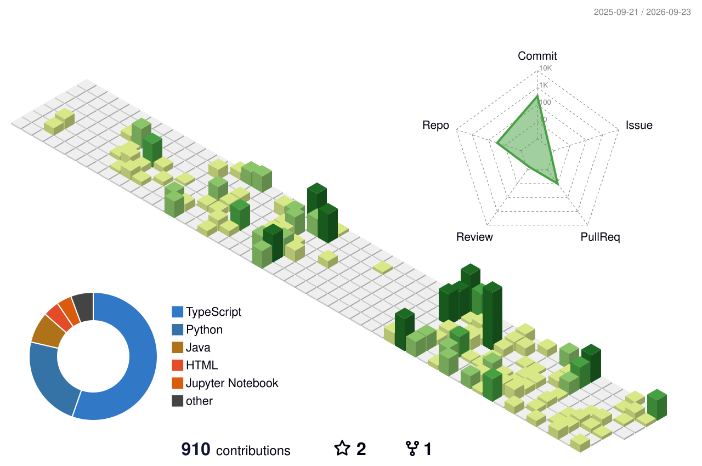

## ⛵나룻배 (nalutbae)

A ferry doesn't hurry. It goes back and forth, one bank to the other, and gets there
when it gets there. That's closer to how this profile grows than any roadmap would be —
a translation moves forward for a while, then a PLC rung takes over, then a query
optimizer, then a chapter again. Nothing here is chasing a deadline. Whatever's on the
other side eventually arrives, at its own pace, one crossing at a time.

I write software. Lately I've also been taking apart the two things I assumed
were furthest from it — a length of wire, and a history book — and finding the
same problem underneath both.

---

### Reading against the record

**[mAI-Brain](https://github.com/nalutbae/mAI-Brain)** — A domain-specific RAG framework:
FastAPI, Qdrant, Next.js, swappable embeddings and models, the whole thing in a compose file.
It ingests EPUB as readily as PDF, which was not an accident.

It has four modes — lookup, summary, essay, inference — and a control for how strong the
supporting evidence has to be before the model is allowed to answer. That control is really
an epistemology setting. Turned up, it means _don't tell me anything the sources don't say_,
which is the only rule I've ever needed for reading a primary document, and one I'd like
machines to be better at than we are.

**[book-the-hidden-history-of-the-korean-war](https://github.com/nalutbae/book-the-hidden-history-of-the-korean-war)** —
An ongoing Korean translation of I. F. Stone's _The Hidden History of the Korean War_ (1952).
Stone never went near the front. He sat with the official communiqués, the State Department
releases, and the wire copy, read them against each other, and wrote down where they refused
to line up. Translating him sentence by sentence is the slowest possible way to learn that
method, and I haven't found a faster one.

It is also, unexpectedly, the hardest technical work on this profile. Every sentence forces
a decision about what the author actually committed to, and the commit history is a record
of me changing my mind about those decisions.

### Where the logic goes

**[nalutbae-jpa-criteria-query](https://github.com/nalutbae/nalutbae-jpa-criteria-query)** —
An abstraction over JPA Specifications, so the frontend can describe what it wants without
the backend hand-writing another predicate. Built after the fourth or fifth time I wrote
the same one.

**[nalutbae-nemologic](https://github.com/nalutbae/nalutbae-nemologic)** (Java) and
**[nemologic.js](https://github.com/nalutbae/nemologic.js)** — the same Nonogram solver,
written twice. The second time wasn't about the puzzle. It was about finding out which
parts of my reasoning had been Java's reasoning all along.

**[cheatsheet-python](https://github.com/nalutbae/cheatsheet-python)** /
**[cheatsheet-node.js](https://github.com/nalutbae/cheatsheet-node.js)** — not tutorials.
A record of the particular way each language prefers a problem to be phrased.

### Newly picked up

I've only recently started on the electrical side, and these repositories are a beginner's
notebook. I'm posting them at that stage on purpose: the things that confuse you at the
beginning are the things you can't remember well enough to write down later.

**[awesome-pcq](https://github.com/nalutbae/awesome-pcq)** — Study notes for the PCQ
(PLC Control Qualification) exam: LS ELECTRIC XGB hardware, XG5000, ladder basics, timer
charts, and the wiring mistakes that cost points. I also collected it because the material
barely exists on GitHub — it lives in Korean YouTube videos and scattered blog posts, and
I wanted one place with a table of contents. Currently working toward Level 3.

**[esp32-study](https://github.com/nalutbae/esp32-study)** — ESP32-S3, in five small steps:
hello world, a blinking LED, a web server, static files, then the LED again — this time
switched from a browser. Nothing here is clever. But somewhere between step two and step
five, a GPIO pin and an HTTP request stop being different kinds of thing.

What I like about a ladder rung is how little it hides. It scans top to bottom, every cycle,
forever, and an unhandled case has a physical location you can point at.

---

A rung, a predicate, a retrieval filter, and a translated sentence are all the same move:
deciding what has to be true before the next thing is allowed to follow. Most of the work,
wherever I'm doing it, is getting the order of things right.
